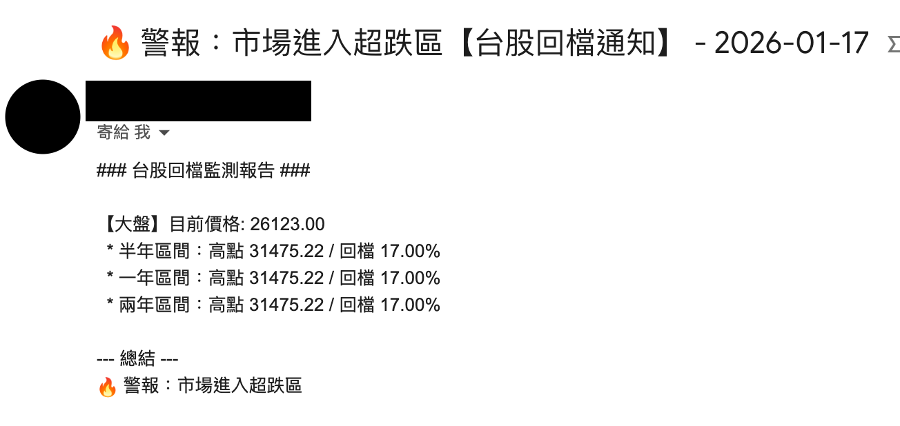

# 📬 RetroTrace Mailer - 台灣股市回檔自動化郵件通知系統

[中文說明](#chinese) | [English Description](#english)

---

<a name="chinese"></a>

# 🇹🇼 股市回檔自動化郵件通知系統


## 📋 專案簡介
這是一個自動化的台股監控工具，旨在追蹤標的（如台股基金、ETF 或個別股票）相對於 **年度最高點** 的回檔幅度。透過 GitHub Actions 每日自動執行，當標的跌幅達到預設的「回檔區間」時，系統將自動發送 Email 提醒，協助投資者克服恐懼，落實紀律投資。

## ✨ 主要功能
* **多標的支援**：支援所有 Yahoo Finance 可查詢之台股代號（如 `2330.TW`, `0050.TW`）。
* **動態回檔計算**：自動抓取過去 252 個交易日數據，計算滾動最高點（Rolling High）。
* **智能觸發通知**：
    * **預設門檻**：當一年內高點回檔達 **5%** 時觸發通知。
    * **自動評價**：根據跌幅深度自動給予「短期整理」或「超跌警報」等評價。
* **雲端全自動化**：利用 GitHub Actions 每日自動掃描，無需手動操作。

### 📩 郵件通知的預覽


## 🛠️ 技術說明
* **數據來源**：`yfinance` (Yahoo Finance API)
* **資料處理**：`pandas`, `numpy`
* **自動化排程**：GitHub Actions (Ubuntu-latest)
* **郵件通知**：Python `smtplib`
* **核心邏輯**：實作了基於一年（252 交易日）最高價的跌幅公式。
* **環境變數架構**：定義了 `GMAIL_USER` 與 `GMAIL_PASSWORD` 接口。

---

## 🚀 快速開始

### 1. 取得 Gmail 應用程式密碼
請至 Google 帳號安全性設定中開啟「兩步驗證」，並產生一組 16 位元的 **「應用程式密碼 (App Password)」**。

### 2. 設定 GitHub Secrets
前往 `Settings > Secrets and variables > Actions`，新增：
* `GMAIL_USER`: 您的 Gmail 帳號。
* `GMAIL_PASSWORD`: 16 位應用程式密碼。

### 3. 自定義監控標的
編輯 `retro_trace_github.py` 中的 `ticker_symbol` 變數。

### 4. 核心判斷邏輯
系統針對「一年期」的回檔幅度進行判定，可修改回檔幅度或高點區間長度：

```python
# 判斷是否觸發門檻 (以一年高點回檔為基準)
if p_name == "一年":
    # 當一年回檔幅度達到 5% 時，標記為觸發告警
    if dd >= 5:
        alert_triggered = True

    # 紀錄並更新該標的的年度最大回測數值
    max_drawdown_level = max(max_drawdown_level, dd)
```
### 5. 修改觸發門檻與總結邏輯
本系統內建了自動分級功能。若欲調整通知門檻或修改總結文字，請編輯 `retro_trace_github.py`：

```python
# 報表結尾會根據最大回檔幅度 (max_drawdown_level) 自動判定：
report_content += "--- 總結 ---\n"
if max_drawdown_level >= 15:
    report_content += "🔥 警報：市場進入超跌區"  # 超過 15% 顯示
elif max_drawdown_level >= 10:
    report_content += "💎 提醒：中度修正達成"    # 10% ~ 15% 顯示
elif max_drawdown_level >= 5:
    report_content += "📈 提示：短期整理"        # 5% ~ 10% 顯示
else:
    report_content += "✅ 市場趨勢強勁。"        # 5% 以下顯示
```
## 📅 執行時間說明
本系統設定為週一至週五 **台灣時間 13:30 (UTC 05:30)** 執行。

> [!IMPORTANT]
> **關於執行延遲**：由於 GitHub Actions 的免費伺服器排隊機制，自動排程通常會有 **10 到 30 分鐘的隨機延遲**。若任務未準時於 13:30 啟動，屬正常現象。

## 📝 免責聲明
本工具僅供策略研究使用，不保證數據之絕對準確性。投資者應自行評估風險。

---

<a name="english"></a>

# 🇺🇸 Taiwan Stock Retrace Automated Notification System


## 📋 Project Introduction
This is an automated monitoring tool for the Taiwan stock market, designed to track the drawdown of specific targets (such as mutual funds, ETFs, or individual stocks) relative to their **annual highs**. By leveraging GitHub Actions for daily execution, the system automatically sends email alerts when the price falls into a predefined "buy zone," helping investors overcome emotional bias and maintain disciplined investing.

## ✨ Key Features
* **Multi-Target Support**: Supports any Taiwan stock ticker available on Yahoo Finance (e.g., `2330.TW`, `0050.TW`).
* **Dynamic Drawdown Calculation**: Automatically fetches data from the past 252 trading days to calculate the rolling high.
* **Intelligent Notification Trigger**:
    * **Default Threshold**: Sends an alert when the 1-year drawdown reaches **5%**.
    * **Automatic Grading**: Provides status updates like "Short-term Consolidation" or "Oversold Alert" based on the correction depth.
* **Cloud Automation**: Runs automatically via GitHub Actions daily without manual operation.

### 📩 Email Notification Preview


## 🛠️ Technical Specifications
* **Data Source**: `yfinance` (Yahoo Finance API)
* **Data Processing**: `pandas`, `numpy`
* **Automation Scheduler**: GitHub Actions (Ubuntu-latest)
* **Email Notification**: Python `smtplib`
* **Core Logic**: Implementation of a drawdown formula based on a 1-year (252 trading days) rolling high.
* **Environment Variable Architecture**: Defined `GMAIL_USER` and `GMAIL_PASSWORD` interfaces.

---

## 🚀 Quick Start

### 1. Obtain Gmail App Password
Go to your Google Account security settings, enable "2-Step Verification," and generate a 16-digit **"App Password."**

### 2. Configure GitHub Secrets
In your GitHub repository, navigate to `Settings > Secrets and variables > Actions`, and add:
* `GMAIL_USER`: Your Gmail account for sending/receiving.
* `GMAIL_PASSWORD`: The 16-digit App Password generated above.

### 3. Customize Monitoring Targets
Edit the `ticker_symbol` variable in `retro_trace_github.py`.

### 4. Core Detection Logic
The system monitors the "1-Year" drawdown window. You can modify the drawdown threshold or the lookback period:
```python
# The report summary will be automatically determined based on the max_drawdown_level:
report_content += "--- Summary ---\n"
if max_drawdown_level >= 15:
    report_content += "🔥 Alert: Market Entering Oversight/Oversold Zone"  # Triggered if > 15%
elif max_drawdown_level >= 10:
    report_content += "💎 Reminder: Moderate Correction Reached"         # Triggered if 10% ~ 15%
elif max_drawdown_level >= 5:
    report_content += "📈 Note: Short-term Consolidation"                # Triggered if 5% ~ 10%
else:
    report_content += "✅ Strong Market Trend."                          # Triggered if < 5%
```

### 5. Customize Thresholds & Summary Logic
The system features integrated grading logic.
To adjust notification thresholds or customize the summary text, edit `retro_trace_github.py`:
```python
# The report summary will be automatically determined based on the max_drawdown_level:
report_content += "--- Summary ---\n"
if max_drawdown_level >= 15:
    report_content += "🔥 Alert: Market Entering Oversold Zone"  # Triggered if > 15%
elif max_drawdown_level >= 10:
    report_content += "💎 Reminder: Moderate Correction Reached" # Triggered if 10% ~ 15%
elif max_drawdown_level >= 5:
    report_content += "📈 Note: Short-term Consolidation"         # Triggered if 5% ~ 10%
else:
    report_content += "✅ Strong Market Trend."
```

## 📅 Execution Schedule
The system is scheduled for Monday through Friday at **13:30 Taiwan Time (05:30 UTC)**.

> [!IMPORTANT]
> **Scheduling Delay**: Due to GitHub Actions' shared infrastructure, scheduled tasks may experience a **10 to 30-minute delay** depending on server load. It is normal if the workflow does not start precisely at 13:30.

## 📝 Disclaimer
This tool is for strategic research only. Data accuracy is not guaranteed. Investors should assess risks independently.